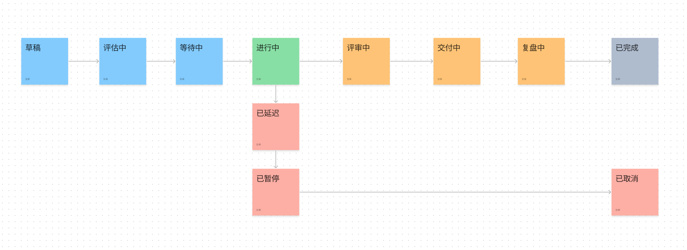

# 项目生命周期

## 项目状态选项

- `drafting`: 起草中。该状态表示项目或事项处于起草阶段，即正在制定计划和准备工作。
- `evaluating`: 评估中。该状态表示项目或事项正在进行评估，以确定其可行性和实施方案。
- `awaiting`: 等待开始。该状态表示项目或事项已经准备就绪，但尚未开始实施，可能是因为需要等待某些资源或条件。
- `in_progress`: 进行中。该状态表示项目或事项正在进行中，即正在实施并按计划推进。
- `delayed`: 已延迟。该状态表示项目或事项因某种原因而延迟，可能需要重新制定计划或采取其他措施来弥补延迟。
- `paused`: 已暂停。该状态表示项目或事项已经暂停，可能是因为需要等待某些资源或条件，或者因为需要重新评估实施方案。
- `reviewing`: 评审中。该状态表示项目或事项正在接受评审，以检查其进展和结果，可能需要做出一些调整或修正。
- `delivering`: 交付中。该状态表示项目或事项正在执行交付阶段，正在进行实施或者交付相关的工作。
- `summarizing`: 复盘中。该状态表示项目或事项已经完成交付，正在进行复盘或者总结工作，以便进一步提高流程和绩效。
- `completed`: 已完成。该状态表示项目或事项已经完成，达到预期的目标和成果。
- `cancelled`: 已取消。该状态表示项目或事项已经取消，可能是因为它不再需要实施，或者因为有更好的替代方案。

`````{tab-set}
````{tab-item} Django
```{code-block} python
from django.db import models

class StatusChoices(models.TextChoices):
    """
    状态选项

    遵循项目和事项的生命周期的定义，使用形容词或动名词描述。
    """
    DRAFT = 'drafting', '起草中'
    EVALUATION = 'evaluating', '评估中'
    AWAITING = 'awaiting', '等待开始'
    IN_PROGRESS = 'in_progress', '进行中'
    DELAYED = 'delayed', '已延迟'
    PAUSED = 'paused', '已暂停'
    REVIEWING = 'reviewing', '评审中'
    DELIVERING = 'delivering', '交付中'
    SUMMARIZING = 'summarizing', '复盘中'
    COMPLETED = 'completed', '已完成'
    CANCELLED = 'cancelled', '已取消'
```
````
`````

## 项目生命周期



使用不同的颜色进行分类、使用箭头来表示一般的变化方向。

% TODO: 进一步定义。
